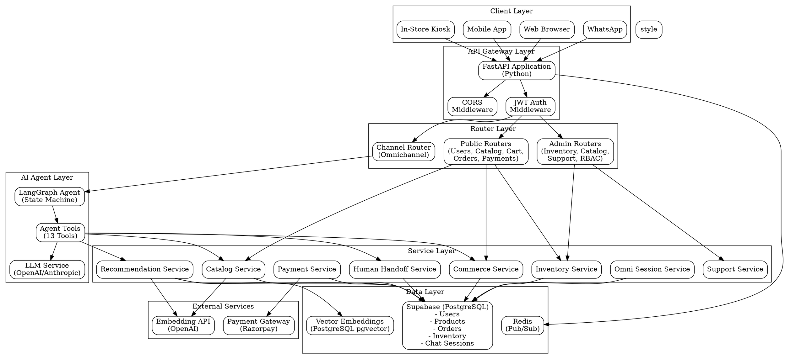

# DAKSHA Retail Backend - System Architecture Documentation

## Table of Contents
1. [System Architecture Diagram](#system-architecture-diagram)
2. [Agent Roles and Workflows](#agent-roles-and-workflows)
3. [Data Schema and API Assumptions](#data-schema-and-api-assumptions)
4. [Channel-Handoff Logic Description](#channel-handoff-logic-description)

---

## System Architecture Diagram



---

## Agent Roles and Workflows

### Primary Agent: Daksha Sales Agent

**Architecture**: LangGraph State Machine with Tool-Enabled LLM

**State Structure**:
```python
AgentState {
    messages: List[BaseMessage]  # Conversation history
    user_id: str                 # User identifier (or "guest")
    channel: str                 # Entry channel (web_cookie, app_device_id, kiosk_device_id, whatsapp, email)
    session_id: str              # Chat session UUID
}
```

**Workflow Graph**:
```
[Entry] → [Agent Node] → [Decision: Tool Calls?]
                            ├─ Yes → [Tools Node] → [Agent Node] (loop)
                            └─ No → [END]
```

### Agent Tools (13 Total)

#### 1. Discovery & Recommendation Tools
- **`search_products_tool`**: Hybrid search (vector + text) for product discovery
- **`get_personalized_recommendations_tool`**: AI-curated recommendations based on user behavior

#### 2. Inventory & Store Tools
- **`find_nearest_store_tool`**: Geospatial store lookup
- **`check_product_availability_nearby_tool`**: Real-time inventory check by location

#### 3. Commerce Tools
- **`get_cart_tool`**: Fetch active shopping cart
- **`add_to_cart_tool`**: Add items to cart with inventory reservation
- **`get_user_context_tool`**: Fetch addresses and payment methods
- **`checkout_tool`**: Create order from cart with allocation logic

#### 4. Order Management Tools
- **`get_order_history_tool`**: Retrieve user's order history
- **`track_order_tool`**: Real-time order tracking

#### 5. Support & Loyalty Tools
- **`lodge_complaint_tool`**: Create support tickets
- **`handoff_to_human_tool`**: Escalate to human agent
- **`check_loyalty_tool`**: Check loyalty points and tier

### Agent Execution Flow

1. **Session Management**
   - Get or create `chat_sessions` record
   - Link to `omni_channel_sessions` for cross-channel continuity

2. **Context Loading**
   - Fetch user's recent product interests (from `user_footprints`)
   - Load active promotions
   - Retrieve conversation history (last 6 messages)

3. **Agent Processing**
   - LLM analyzes user intent
   - Agent selects appropriate tools
   - Tools execute and return structured data
   - Agent formulates natural language response

4. **Response Generation**
   - Text response for conversational UI
   - Structured payload for product cards, orders, etc.
   - Metadata tracking (tool used, payload type)

5. **Post-Processing**
   - Save message to `chat_messages` table
   - Update user embeddings (background)
   - Log agent run to `agent_runs` table

### Specialized Admin Agents

#### Fulfillment Agent (`/admin/fulfillment`)
- **Purpose**: Assist store/warehouse staff with order fulfillment
- **Context**: RBAC-based access (store_id or warehouse_id)
- **Capabilities**: View fulfillment queue, update status, allocate inventory

---

## Data Schema and API Assumptions

### Core Entity Relationships

```
users (1) ──< (N) chat_sessions
users (1) ──< (N) carts
users (1) ──< (N) orders
users (1) ──< (N) omni_channel_sessions

chat_sessions (1) ──< (N) chat_messages
chat_sessions (1) ──< (N) agent_runs
chat_sessions (1) ──< (N) human_handoffs

carts (1) ──< (N) cart_items
orders (1) ──< (N) order_items
orders (1) ──< (N) fulfillments
orders (1) ──< (N) order_allocations

products (1) ──< (N) product_variants
product_variants (1) ──< (N) inventory

fulfillment_locations (1) ──< (N) inventory
stores (1) ──< (1) fulfillment_locations
warehouses (1) ──< (1) fulfillment_locations
```

### Key Tables and Sample Data

#### Users Table
```json
{
  "id": "550e8400-e29b-41d4-a716-446655440000",
  "full_name": "John Doe",
  "phone_number": "+911234567890",
  "is_active": true,
  "loyalty_tier": "gold",
  "loyalty_points": 1250,
  "preferred_languages": ["en", "hi"],
  "ai_profile_summary": {
    "style_preferences": ["casual", "sporty"],
    "price_range": "mid",
    "favorite_categories": ["shoes", "apparel"]
  },
  "created_at": "2024-01-15T10:30:00Z"
}
```

#### Chat Sessions Table
```json
{
  "id": "660e8400-e29b-41d4-a716-446655440001",
  "user_id": "550e8400-e29b-41d4-a716-446655440000",
  "entry_channel": "web_cookie",
  "entry_channel_id": "browser_cookie_abc123",
  "graph_state": {
    "current_node": "agent",
    "tool_calls_count": 2
  },
  "summary": "User searching for running shoes",
  "consecutive_error_count": 0,
  "sentiment_trend": 0.75,
  "last_updated": "2024-01-15T11:45:00Z"
}
```

#### Products Table (Sample CSV)
```csv
id,name,description,gender,base_price,category_id,style_tags,is_active
prod-001,Running Pro 2024,High-performance running shoes,unisex,4999.00,cat-shoes,"{running,sporty,athletic}",true
prod-002,Summer Dress Floral,Lightweight floral summer dress,women,2999.00,cat-apparel,"{casual,summer,floral}",true
prod-003,Denim Jacket Classic,Vintage-style denim jacket,unisex,3999.00,cat-apparel,"{casual,vintage,denim}",true
```

#### Orders Table
```json
{
  "id": "770e8400-e29b-41d4-a716-446655440002",
  "user_id": "550e8400-e29b-41d4-a716-446655440000",
  "status": "confirmed",
  "type": "delivery",
  "total_amount": 8998.00,
  "discount_amount": 500.00,
  "loyalty_points_used": 0,
  "applied_promotion_id": "promo-summer2024",
  "store_id": null,
  "delivery_address_id": "addr-001",
  "cart_id": "cart-001",
  "created_at": "2024-01-15T12:00:00Z"
}
```

#### Inventory Table
```json
{
  "id": "inv-001",
  "product_variant_id": "variant-001",
  "fulfillment_location_id": "store-mumbai-001",
  "quantity_on_hand": 15,
  "quantity_reserved": 2,
  "low_stock_threshold": 5,
  "section_id": "section-shoes-1",
  "aisle_number": 3,
  "bay_number": 2,
  "shelf_height": 1,
  "display_location": "Front Display",
  "version": 1
}
```

### API Endpoint Assumptions

#### Authentication
- **Method**: JWT Bearer Token
- **Header**: `Authorization: Bearer <token>`
- **Token Source**: Supabase Auth (validated via `SUPABASE_JWT_SECRET`)

#### Channel Message API
```http
POST /channels/message
Content-Type: application/json
Authorization: Bearer <token>

{
  "channel_type": "web",           // web, app, kiosk, whatsapp, email
  "channel_id": "browser_cookie_123",
  "message": "Show me running shoes"
}

Response:
{
  "reply": {
    "reply": "Here are the best running shoes I found for you.",
    "payload": {
      "type": "products",
      "data": [
        {
          "id": "prod-001",
          "name": "Running Pro 2024",
          "price": 4999.00,
          "image_url": "https://...",
          "in_stock": true
        }
      ]
    }
  }
}
```

#### Cart API
```http
GET /cart
Authorization: Bearer <token>

Response:
{
  "id": "cart-001",
  "user_id": "user-001",
  "status": "active",
  "items": [
    {
      "id": "item-001",
      "product_variant_id": "variant-001",
      "quantity": 2,
      "fulfillment_location_id": "store-mumbai-001",
      "product": {
        "name": "Running Pro 2024",
        "price": 4999.00
      }
    }
  ],
  "created_at": "2024-01-15T10:00:00Z"
}
```

---

## Channel-Handoff Logic Description

### Omnichannel Session Management

The system maintains cross-channel continuity through the `omni_channel_sessions` table, which binds:
- **Channel Type**: `web_cookie`, `app_device_id`, `kiosk_device_id`, `whatsapp`, `email`
- **Channel ID**: Unique identifier for the channel instance (cookie, device ID, phone number, etc.)
- **User ID**: Authenticated user (nullable for guests)
- **Active Cart ID**: Current shopping cart
- **Chat Session ID**: Active conversation session

### Channel Handoff Flow

```
┌─────────────────────────────────────────────────────────────┐
│                    Channel Handoff Process                   │
└─────────────────────────────────────────────────────────────┘

1. USER INITIATES SESSION
   ├─ Web Browser → POST /omni/session
   │  └─ channel_type: "web", channel_id: "cookie_abc123"
   │
   ├─ Mobile App → POST /omni/session
   │  └─ channel_type: "app", channel_id: "device_xyz789"
   │
   └─ Kiosk → POST /omni/session
      └─ channel_type: "kiosk", channel_id: "kiosk_store001"

2. SESSION LOOKUP & CREATION
   ├─ Check omni_channel_sessions for (channel_type, channel_id)
   ├─ If exists: Update last_active_at, link user_id if authenticated
   └─ If new: Create session, create guest cart

3. USER AUTHENTICATION EVENT
   ├─ User logs in via /auth/login-phone
   ├─ System calls identify_and_merge_user() RPC
   │  ├─ Merges guest cart → user cart
   │  ├─ Links omni_channel_sessions.user_id
   │  └─ Updates all active sessions for user
   └─ All channels now share same user context

4. CROSS-CHANNEL CONTINUITY
   ├─ User adds item on Web → cart_id: "cart-001"
   ├─ User opens Mobile App → Same cart_id retrieved
   ├─ User visits Kiosk → Same cart_id available
   └─ All channels see same cart state

5. CHAT SESSION HANDOFF
   ├─ Each channel can have independent chat_session_id
   ├─ But user context (preferences, history) is shared
   ├─ Agent uses user_id for personalization
   └─ Channel-specific context stored in chat_sessions.entry_channel
```

### Implementation Details

#### Session Upsert Logic (`OmniSessionService.upsert_session`)
```python
1. Query: SELECT * FROM omni_channel_sessions 
          WHERE channel_type = ? AND channel_id = ?

2. If exists:
   - UPDATE: user_id, chat_session_id, active_cart_id, last_active_at
   - Return existing session_id

3. If new:
   - INSERT: new omni_channel_sessions record
   - CREATE: new cart with status='active' (if user_id provided)
   - CREATE: new chat_sessions record
   - Return new session_id
```

#### User Identity Merging (`identify_and_merge_user` RPC)
```sql
-- Pseudocode for Supabase RPC function
FUNCTION identify_and_merge_user(p_phone_number, p_guest_id):
  1. Find user by phone_number OR create new user
  2. Find guest cart WHERE guest_id = p_guest_id
  3. Find user cart WHERE user_id = user.id AND status = 'active'
  4. IF guest cart exists AND user cart exists:
       - Merge guest cart items into user cart
       - DELETE guest cart
  5. UPDATE all omni_channel_sessions SET user_id = user.id 
     WHERE channel_id matches guest sessions
  6. RETURN user_id
```

### Channel-Specific Behaviors

#### Web Channel (`web_cookie`)
- **Channel ID**: Browser cookie or localStorage ID
- **Persistence**: Session cookie (expires on browser close)
- **Handoff**: Merges to authenticated user on login

#### Mobile App (`app_device_id`)
- **Channel ID**: Device UUID or Firebase Instance ID
- **Persistence**: Stored in app storage (persists across app restarts)
- **Handoff**: Links to user account on authentication

#### Kiosk (`kiosk_device_id`)
- **Channel ID**: Physical kiosk device identifier
- **Persistence**: Session-based (expires after inactivity)
- **Handoff**: Can link to user via phone number login

#### WhatsApp (`whatsapp`)
- **Channel ID**: WhatsApp phone number
- **Persistence**: Permanent (phone number is stable identifier)
- **Handoff**: Direct user linking via phone number

### Human Handoff Integration

When agent escalates to human support:

```python
1. Agent calls handoff_to_human_tool()
2. Creates human_handoffs record:
   - session_id: Current chat session
   - reason: "complex_query", "complaint", "technical_issue"
   - handoff_summary: Conversation summary
   - status: "pending"

3. Auto-creates support_tickets record:
   - user_id: From session
   - ticket_status: "open"
   - issue_summary: Reason for handoff
   - conversation_summary: Full context

4. Support agent accesses via /admin/support/tickets
5. Support agent can view full chat history via session_id
6. Resolution updates both human_handoffs and support_tickets
```

### State Synchronization

- **Real-time Updates**: Redis Pub/Sub for cross-channel notifications
- **Cart Sync**: All channels poll/update same cart_id
- **Order Updates**: WebSocket or polling for order status changes
- **Inventory Reservations**: Time-bound reservations prevent double-booking

---

## Key Features Summary

### 1. Multi-Agent Architecture
- Primary Sales Agent with 13 specialized tools
- Admin Fulfillment Agent for operations
- Extensible tool system for new capabilities

### 2. Omnichannel Support
- Seamless handoff between web, mobile, kiosk, WhatsApp
- Shared cart and user context across channels
- Channel-specific session management

### 3. Intelligent Inventory Management
- Real-time stock tracking with reservations
- Geospatial store/inventory lookup
- Low-stock alerts and automated reordering

### 4. AI-Powered Personalization
- Vector embeddings for product search
- User behavior tracking and style profiling
- Personalized recommendations based on footprints

### 5. Order Fulfillment Intelligence
- Automated allocation (store vs warehouse)
- Multi-source fulfillment support
- Real-time tracking and status updates

### 6. Human-AI Collaboration
- Seamless escalation to human agents
- Context preservation during handoff
- Support ticket integration

---

*This documentation reflects the production architecture of DAKSHA Retail Backend v1.0*

