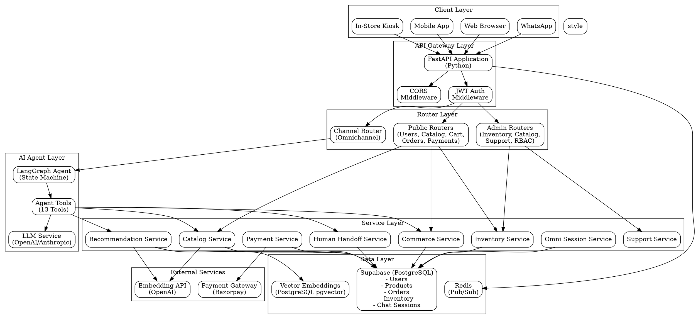

# DAKSHA 
EY TECHATHON 6.0


 uvicorn app.main:app --reload --host 0.0.0.0 --port 8000


 onClick={() => {
  trackEvent("click_product", { product_id: product.id });
  navigate(`/products/${product.id}`);
}}


trackEvent("search", {
  query: searchText,
  filters: appliedFilters,
});


trackAddToCart(product, qty);


trackEvent("checkout_start", { cart_total, items });

---

# DAKSHA Retail Backend - System Architecture Documentation

## Table of Contents
1. [System Architecture Diagram](#system-architecture-diagram)
2. [Agent Roles and Workflows](#agent-roles-and-workflows)
3. [Data Schema and API Assumptions](#data-schema-and-api-assumptions)
4. [Channel-Handoff Logic Description](#channel-handoff-logic-description)

---

## System Architecture Diagram



**To generate the diagram**, use Graphviz:
```bash
dot -Tpng architecture.dot -o architecture.png
dot -Tsvg architecture.dot -o architecture.svg
```

---

## Agent Roles and Workflows

### Primary Agent: Daksha Sales Agent

**Architecture**: LangGraph State Machine with Tool-Enabled LLM

**State Structure**:
```python
AgentState {
    messages: List[BaseMessage]  # Conversation history
    user_id: str                 # User identifier (or "guest")
    channel: str                 # Entry channel (web_cookie, app_device_id, kiosk_device_id, whatsapp, email)
    session_id: str              # Chat session UUID
}
```

**Workflow Graph**:
```
[Entry] → [Agent Node] → [Decision: Tool Calls?]
                            ├─ Yes → [Tools Node] → [Agent Node] (loop)
                            └─ No → [END]
```

### Agent Tools (13 Total)

#### 1. Discovery & Recommendation Tools
- **`search_products_tool`**: Hybrid search (vector + text) for product discovery
  - Input: Query string, limit
  - Output: JSON array of products with embeddings similarity scores
  - Use case: "Show me black shoes", "Find wedding dresses"

- **`get_personalized_recommendations_tool`**: AI-curated recommendations based on user behavior
  - Input: User ID, limit
  - Output: Personalized product recommendations
  - Use case: "What should I buy?", "Show me something new"

#### 2. Inventory & Store Tools
- **`find_nearest_store_tool`**: Geospatial store lookup
  - Input: Latitude, longitude
  - Output: Nearest stores with distance calculations
  - Use case: "Find stores near me"

- **`check_product_availability_nearby_tool`**: Real-time inventory check by location
  - Input: Product variant ID, latitude, longitude
  - Output: Stores with available stock and quantities
  - Use case: "Where can I buy this today?", "Is this available nearby?"

#### 3. Commerce Tools
- **`get_cart_tool`**: Fetch active shopping cart
  - Input: User ID
  - Output: Cart with items, quantities, fulfillment locations
  - Use case: "Show my cart"

- **`add_to_cart_tool`**: Add items to cart with inventory reservation
  - Input: User ID, variant ID, quantity
  - Output: Confirmation message
  - Use case: "Add this to cart"

- **`get_user_context_tool`**: Fetch addresses and payment methods
  - Input: User ID
  - Output: Addresses and payment methods for checkout
  - Use case: Pre-checkout context gathering

- **`checkout_tool`**: Create order from cart with allocation logic
  - Input: User ID, address ID (optional)
  - Output: Order details with fulfillment allocation
  - Use case: "Checkout", "Place order"

#### 4. Order Management Tools
- **`get_order_history_tool`**: Retrieve user's order history
  - Input: User ID
  - Output: List of past orders with status
  - Use case: "Show my orders", "Order history"

- **`track_order_tool`**: Real-time order tracking
  - Input: Order ID
  - Output: Order status, fulfillment details, tracking information
  - Use case: "Where is my order?", "Track order #123"

#### 5. Support & Loyalty Tools
- **`lodge_complaint_tool`**: Create support tickets
  - Input: User ID, complaint description
  - Output: Support ticket ID
  - Use case: "I have a complaint", "Report an issue"

- **`handoff_to_human_tool`**: Escalate to human agent
  - Input: Session ID, reason, summary
  - Output: Handoff record ID
  - Use case: "I want to speak to someone", "Connect me to support"

- **`check_loyalty_tool`**: Check loyalty points and tier
  - Input: User ID
  - Output: Loyalty tier, points balance, redemption options
  - Use case: "Check my points", "What's my loyalty status?"

### Agent Execution Flow

1. **Session Management**
   - Get or create `chat_sessions` record
   - Link to `omni_channel_sessions` for cross-channel continuity
   - Maintain conversation state in `graph_state` JSONB field

2. **Context Loading**
   - Fetch user's recent product interests (from `user_footprints`)
   - Load active promotions from `promotions` table
   - Retrieve conversation history (last 6 messages from `chat_messages`)
   - Build user context string for LLM prompt

3. **Agent Processing**
   - LLM analyzes user intent from message
   - Agent selects appropriate tools based on intent
   - Tools execute and return structured data
   - Agent formulates natural language response
   - Loop continues if tool calls are needed

4. **Response Generation**
   - Text response for conversational UI
   - Structured payload for product cards, orders, etc.
   - Metadata tracking (tool used, payload type) stored in `chat_messages.metadata`

5. **Post-Processing**
   - Save message to `chat_messages` table with metadata
   - Update user embeddings (background job via `EmbeddingsWorker`)
   - Log agent run to `agent_runs` table for analytics
   - Update session `last_updated` timestamp

### Specialized Admin Agents

#### Fulfillment Agent (`/admin/fulfillment`)
- **Purpose**: Assist store/warehouse staff with order fulfillment
- **Context**: RBAC-based access (store_id or warehouse_id from `user_roles`)
- **Capabilities**: 
  - View fulfillment queue for assigned location
  - Update fulfillment status
  - Allocate inventory to orders
  - Generate shipping labels
- **Access Control**: Requires `require_store_access` or `require_warehouse_access` dependency

---

## Data Schema and API Assumptions

### Core Entity Relationships

```
users (1) ──< (N) chat_sessions
users (1) ──< (N) carts
users (1) ──< (N) orders
users (1) ──< (N) omni_channel_sessions
users (1) ──< (N) user_addresses
users (1) ──< (N) user_payment_methods
users (1) ──< (N) support_tickets

chat_sessions (1) ──< (N) chat_messages
chat_sessions (1) ──< (N) agent_runs
chat_sessions (1) ──< (N) human_handoffs
chat_sessions (1) ──< (N) ai_recommendations

carts (1) ──< (N) cart_items
carts (1) ──< (N) inventory_reservations

orders (1) ──< (N) order_items
orders (1) ──< (N) fulfillments
orders (1) ──< (N) order_allocations
orders (1) ──< (N) payments
orders (1) ──< (N) returns

products (1) ──< (N) product_variants
product_variants (1) ──< (N) inventory
product_variants (1) ──< (N) cart_items
product_variants (1) ──< (N) order_items

fulfillment_locations (1) ──< (N) inventory
fulfillment_locations (1) ──< (N) order_allocations
stores (1) ──< (1) fulfillment_locations
warehouses (1) ──< (1) fulfillment_locations
```

### Key Tables and Sample Data

#### Users Table
```json
{
  "id": "550e8400-e29b-41d4-a716-446655440000",
  "full_name": "John Doe",
  "phone_number": "+911234567890",
  "is_active": true,
  "phone_verified_at": "2024-01-10T08:00:00Z",
  "loyalty_tier": "gold",
  "loyalty_points": 1250,
  "preferred_languages": ["en", "hi"],
  "ai_profile_summary": {
    "style_preferences": ["casual", "sporty"],
    "price_range": "mid",
    "favorite_categories": ["shoes", "apparel"],
    "size_preferences": {"shoes": "10", "apparel": "M"}
  },
  "gender": "men",
  "date_of_birth": "1990-05-15",
  "created_at": "2024-01-15T10:30:00Z",
  "last_active_at": "2024-01-20T14:22:00Z"
}
```

#### Chat Sessions Table
```json
{
  "id": "660e8400-e29b-41d4-a716-446655440001",
  "user_id": "550e8400-e29b-41d4-a716-446655440000",
  "entry_channel": "web_cookie",
  "entry_channel_id": "browser_cookie_abc123",
  "graph_state": {
    "current_node": "agent",
    "tool_calls_count": 2,
    "last_tool": "search_products_tool"
  },
  "summary": "User searching for running shoes and athletic wear",
  "consecutive_error_count": 0,
  "sentiment_trend": 0.75,
  "last_updated": "2024-01-15T11:45:00Z"
}
```

#### Products Table (Sample CSV)
```csv
id,name,description,gender,base_price,category_id,style_tags,is_active,created_at
prod-001,Running Pro 2024,High-performance running shoes with advanced cushioning,unisex,4999.00,cat-shoes,"{running,sporty,athletic}",true,2024-01-01T00:00:00Z
prod-002,Summer Dress Floral,Lightweight floral summer dress perfect for casual outings,women,2999.00,cat-apparel,"{casual,summer,floral}",true,2024-01-02T00:00:00Z
prod-003,Denim Jacket Classic,Vintage-style denim jacket with modern fit,unisex,3999.00,cat-apparel,"{casual,vintage,denim}",true,2024-01-03T00:00:00Z
```

#### Orders Table
```json
{
  "id": "770e8400-e29b-41d4-a716-446655440002",
  "user_id": "550e8400-e29b-41d4-a716-446655440000",
  "status": "confirmed",
  "type": "delivery",
  "total_amount": 8998.00,
  "discount_amount": 500.00,
  "loyalty_points_used": 0,
  "applied_promotion_id": "promo-summer2024",
  "store_id": null,
  "delivery_address_id": "addr-001",
  "cart_id": "cart-001",
  "order_notes": "Please deliver before 6 PM",
  "created_at": "2024-01-15T12:00:00Z"
}
```

#### Inventory Table
```json
{
  "id": "inv-001",
  "product_variant_id": "variant-001",
  "fulfillment_location_id": "store-mumbai-001",
  "quantity_on_hand": 15,
  "quantity_reserved": 2,
  "low_stock_threshold": 5,
  "section_id": "section-shoes-1",
  "aisle_number": 3,
  "bay_number": 2,
  "shelf_height": 1,
  "display_location": "Front Display",
  "version": 1
}
```

#### Omni Channel Sessions Table
```json
{
  "id": "omni-001",
  "channel_type": "web_cookie",
  "channel_id": "browser_cookie_abc123",
  "user_id": "550e8400-e29b-41d4-a716-446655440000",
  "active_cart_id": "cart-001",
  "chat_session_id": "660e8400-e29b-41d4-a716-446655440001",
  "context_summary": "Shopping for athletic wear",
  "last_active_at": "2024-01-15T11:45:00Z"
}
```

### API Endpoint Assumptions

#### Authentication
- **Method**: JWT Bearer Token
- **Header**: `Authorization: Bearer <token>`
- **Token Source**: Supabase Auth (validated via `SUPABASE_JWT_SECRET`)
- **Guest Access**: Some endpoints allow `user_id: null` or `user_id: "guest"`

#### Channel Message API
```http
POST /channels/message
Content-Type: application/json
Authorization: Bearer <token>

{
  "channel_type": "web",           // web, app, kiosk, whatsapp, email
  "channel_id": "browser_cookie_123",
  "message": "Show me running shoes"
}

Response:
{
  "reply": {
    "reply": "Here are the best running shoes I found for you.",
    "payload": {
      "type": "products",
      "data": [
        {
          "id": "prod-001",
          "name": "Running Pro 2024",
          "price": 4999.00,
          "image_url": "https://cdn.example.com/prod-001.jpg",
          "in_stock": true,
          "fulfillment_locations": [
            {
              "location_id": "store-mumbai-001",
              "location_name": "Mumbai Store",
              "quantity_available": 15
            }
          ]
        }
      ]
    }
  }
}
```

#### Cart API
```http
GET /cart
Authorization: Bearer <token>

Response:
{
  "id": "cart-001",
  "user_id": "user-001",
  "status": "active",
  "items": [
    {
      "id": "item-001",
      "product_variant_id": "variant-001",
      "quantity": 2,
      "fulfillment_location_id": "store-mumbai-001",
      "product": {
        "name": "Running Pro 2024",
        "price": 4999.00,
        "image_url": "https://cdn.example.com/prod-001.jpg"
      }
    }
  ],
  "created_at": "2024-01-15T10:00:00Z",
  "updated_at": "2024-01-15T11:30:00Z"
}
```

#### Order Checkout API
```http
POST /commerce/checkout
Content-Type: application/json
Authorization: Bearer <token>

{
  "order_type": "delivery",        // delivery, pickup, reserve
  "address_id": "addr-001",
  "payment_method_id": "pm-001",
  "applied_promotion_code": "SUMMER2024"
}

Response:
{
  "order_id": "770e8400-e29b-41d4-a716-446655440002",
  "status": "confirmed",
  "total_amount": 8998.00,
  "discount_amount": 500.00,
  "fulfillment_allocations": [
    {
      "fulfillment_location_id": "store-mumbai-001",
      "allocation_type": "store",
      "items": ["variant-001", "variant-002"]
    }
  ],
  "payment_id": "pay-001",
  "estimated_delivery": "2024-01-17T18:00:00Z"
}
```

---

## Channel-Handoff Logic Description

### Omnichannel Session Management

The system maintains cross-channel continuity through the `omni_channel_sessions` table, which binds:
- **Channel Type**: `web_cookie`, `app_device_id`, `kiosk_device_id`, `whatsapp`, `email`
- **Channel ID**: Unique identifier for the channel instance (cookie, device ID, phone number, etc.)
- **User ID**: Authenticated user (nullable for guests)
- **Active Cart ID**: Current shopping cart (shared across channels)
- **Chat Session ID**: Active conversation session (can be channel-specific or shared)

### Channel Handoff Flow

```
┌─────────────────────────────────────────────────────────────┐
│                    Channel Handoff Process                   │
└─────────────────────────────────────────────────────────────┘

1. USER INITIATES SESSION
   ├─ Web Browser → POST /omni/session
   │  └─ channel_type: "web", channel_id: "cookie_abc123"
   │  └─ Creates: omni_channel_sessions, guest cart, chat_sessions
   │
   ├─ Mobile App → POST /omni/session
   │  └─ channel_type: "app", channel_id: "device_xyz789"
   │  └─ Creates: Separate session, but can link to same user_id
   │
   └─ Kiosk → POST /omni/session
      └─ channel_type: "kiosk", channel_id: "kiosk_store001"
      └─ Creates: Temporary session (expires on inactivity)

2. SESSION LOOKUP & CREATION
   ├─ Check omni_channel_sessions for (channel_type, channel_id)
   ├─ If exists: 
   │  ├─ Update last_active_at
   │  ├─ Link user_id if authenticated
   │  └─ Retrieve active_cart_id
   └─ If new: 
      ├─ Create omni_channel_sessions record
      ├─ Create guest cart (if user_id provided)
      └─ Create chat_sessions record

3. USER AUTHENTICATION EVENT
   ├─ User logs in via /auth/login-phone
   ├─ System calls identify_and_merge_user() RPC function
   │  ├─ Finds user by phone_number OR creates new user
   │  ├─ Merges guest cart → user cart
   │  │  ├─ Transfers cart_items from guest cart
   │  │  ├─ Updates inventory_reservations
   │  │  └─ Deletes guest cart
   │  ├─ Links omni_channel_sessions.user_id
   │  └─ Updates all active sessions for user across channels
   └─ All channels now share same user context and cart

4. CROSS-CHANNEL CONTINUITY
   ├─ User adds item on Web → cart_id: "cart-001"
   ├─ User opens Mobile App → Same cart_id retrieved via user_id
   ├─ User visits Kiosk → Same cart_id available after login
   └─ All channels see same cart state and user preferences

5. CHAT SESSION HANDOFF
   ├─ Each channel can have independent chat_session_id
   ├─ But user context (preferences, history) is shared via user_id
   ├─ Agent uses user_id for personalization across all channels
   └─ Channel-specific context stored in chat_sessions.entry_channel
```

### Implementation Details

#### Session Upsert Logic (`OmniSessionService.upsert_session`)
```python
def upsert_session(channel_type, channel_id, user_id, chat_session_id, active_cart_id):
    1. Query: SELECT * FROM omni_channel_sessions 
              WHERE channel_type = ? AND channel_id = ?

    2. If exists:
       - UPDATE: user_id, chat_session_id, active_cart_id, last_active_at
       - Return existing session_id

    3. If new:
       - INSERT: new omni_channel_sessions record
       - CREATE: new cart with status='active' (if user_id provided)
       - CREATE: new chat_sessions record with entry_channel
       - Return new session_id
```

#### User Identity Merging (`identify_and_merge_user` RPC)
```sql
-- Pseudocode for Supabase RPC function
FUNCTION identify_and_merge_user(p_phone_number TEXT, p_guest_id TEXT):
  1. Find user WHERE phone_number = p_phone_number
     IF NOT FOUND: CREATE new user with phone_number
  
  2. Find guest cart WHERE guest_id = p_guest_id AND status = 'active'
  
  3. Find user cart WHERE user_id = user.id AND status = 'active'
  
  4. IF guest cart exists AND user cart exists:
       - Merge guest cart items into user cart
       - Handle conflicts (update quantities, remove duplicates)
       - Transfer inventory_reservations
       - DELETE guest cart
     ELSE IF guest cart exists AND no user cart:
       - UPDATE guest cart SET user_id = user.id, guest_id = NULL
  
  5. UPDATE all omni_channel_sessions 
     SET user_id = user.id 
     WHERE channel_id matches guest sessions
  
  6. UPDATE all carts 
     SET user_id = user.id, guest_id = NULL
     WHERE guest_id = p_guest_id
  
  7. RETURN user.id
```

### Channel-Specific Behaviors

#### Web Channel (`web_cookie`)
- **Channel ID**: Browser cookie or localStorage ID (e.g., `localStorage.getItem('device_id')`)
- **Persistence**: Session cookie (expires on browser close) or localStorage (persists)
- **Handoff**: Merges to authenticated user on login
- **Use Case**: E-commerce website, progressive web app

#### Mobile App (`app_device_id`)
- **Channel ID**: Device UUID or Firebase Instance ID
- **Persistence**: Stored in app storage (persists across app restarts)
- **Handoff**: Links to user account on authentication
- **Use Case**: Native iOS/Android app, React Native app

#### Kiosk (`kiosk_device_id`)
- **Channel ID**: Physical kiosk device identifier (e.g., `kiosk_store001_floor2`)
- **Persistence**: Session-based (expires after inactivity timeout)
- **Handoff**: Can link to user via phone number login or QR code scan
- **Use Case**: In-store kiosks, self-service terminals

#### WhatsApp (`whatsapp`)
- **Channel ID**: WhatsApp phone number (E.164 format)
- **Persistence**: Permanent (phone number is stable identifier)
- **Handoff**: Direct user linking via phone number
- **Use Case**: WhatsApp Business API integration, conversational commerce

#### Email (`email`)
- **Channel ID**: Email address
- **Persistence**: Permanent (email is stable identifier)
- **Handoff**: Links via email verification
- **Use Case**: Email-based order tracking, promotional campaigns

### Human Handoff Integration

When agent escalates to human support:

```python
1. Agent calls handoff_to_human_tool(reason, summary)
   
2. Creates human_handoffs record:
   {
     "session_id": "current_chat_session_id",
     "reason": "complex_query" | "complaint" | "technical_issue" | "payment_problem",
     "handoff_summary": "Full conversation summary with context",
     "status": "pending"
   }

3. Auto-creates support_tickets record:
   {
     "user_id": "from_session",
     "ticket_status": "open",
     "issue_summary": "Reason for handoff",
     "conversation_summary": "Full chat context",
     "priority": "medium" | "high" | "urgent",
     "sla_due_at": "calculated based on priority"
   }

4. Support agent accesses via /admin/support/tickets
   - Views all pending handoffs
   - Can filter by priority, status, user

5. Support agent can view full chat history:
   - GET /chat/sessions/{session_id}/messages
   - Shows complete conversation with tool calls and metadata

6. Resolution workflow:
   - Support agent updates support_tickets.status = "resolved"
   - Updates human_handoffs.status = "resolved"
   - Adds resolution_notes
   - System notifies user via notification service
```

### State Synchronization

- **Real-time Updates**: Redis Pub/Sub for cross-channel notifications
  - Cart updates broadcast to all active sessions
  - Order status changes trigger notifications
  - Inventory updates affect availability checks

- **Cart Sync**: All channels poll/update same `cart_id` via `user_id`
  - Last-write-wins for quantity updates
  - Inventory reservations prevent double-booking
  - Cart expiration handled by background worker

- **Order Updates**: WebSocket or polling for order status changes
  - Fulfillment status updates
  - Shipping tracking information
  - Payment status changes

- **Inventory Reservations**: Time-bound reservations prevent double-booking
  - 15-minute expiration for cart items
  - Automatic release on cart abandonment
  - Background cleanup job runs every 5 minutes

---

## Key Features Summary

### 1. Multi-Agent Architecture
- **Primary Sales Agent** with 13 specialized tools covering discovery, commerce, support
- **Admin Fulfillment Agent** for operations staff with RBAC-based access
- **Extensible tool system** for adding new capabilities without modifying core agent logic

### 2. Omnichannel Support
- **Seamless handoff** between web, mobile, kiosk, WhatsApp, email
- **Shared cart and user context** across all channels
- **Channel-specific session management** with unified user identity
- **Cross-channel conversation continuity** via user_id linkage

### 3. Intelligent Inventory Management
- **Real-time stock tracking** with versioned inventory records
- **Geospatial store/inventory lookup** using PostgreSQL PostGIS
- **Low-stock alerts** and automated reordering triggers
- **Inventory reservations** prevent overselling during checkout

### 4. AI-Powered Personalization
- **Vector embeddings** for semantic product search (pgvector)
- **User behavior tracking** via `user_footprints` table
- **Style profiling** stored in `user_style_profile` with embeddings
- **Personalized recommendations** based on browsing history and preferences

### 5. Order Fulfillment Intelligence
- **Automated allocation** (store vs warehouse) via `AllocationService`
- **Multi-source fulfillment** support (one order, multiple locations)
- **Real-time tracking** with fulfillment status updates
- **SLA management** for support tickets and order fulfillment

### 6. Human-AI Collaboration
- **Seamless escalation** to human agents via `handoff_to_human_tool`
- **Context preservation** during handoff (full conversation history)
- **Support ticket integration** with automatic ticket creation
- **Priority-based routing** for urgent issues

### 7. Scalable Data Architecture
- **PostgreSQL** with JSONB for flexible schema evolution
- **Vector search** via pgvector for semantic product discovery
- **Redis** for pub/sub and caching
- **Background workers** for embeddings computation and cleanup jobs

---

*This documentation reflects the production architecture of DAKSHA Retail Backend v1.0 - EY Techathon 6.0*
